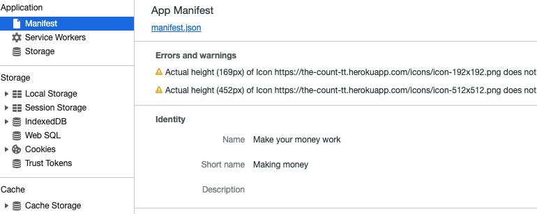

# the_count_TT

  ## Table of Contents
  * [Description](#descrip)
  * [Installation](#install)
  * [Usage](#usage)
  * [Contributions](#contri)
  * [Tests](#tests)
  * [Contact & Qustions](#contact)
  * [License](#license)
  * [Powered By](#powered-by)
  
  ### Description:
      The battle is nearly here.  The struggles have been real, but there needed to be a way to track the toll that time had dealt out.  A system was formed for the traveler to use to keep track of all the time and effort that had been used.

      This was a simple feat for the wanderer.  It was like all the parts had been provided and it was simply a matter of assembling them together.  It was a nice rest to simply store stuff and not have to worry if he left them that they would disappear. Everything was in its place and it was time to rest and get ready for the final struggles ahead.  How would he react to what laid before him?  Only time would tell.

      As he reclined against the tree, he realized that he should enjoy the rest while it was available.  The cool autumn sun was fading as his mind allowed him to relax.  More was to come, but that was the future's concern.  

  
  ### Installation:
     To access the site, a user can navigate to it and enter in deposits or withdrawls.

        The site can be used in an offline mode.  The data entries will be saved and uploaded when there is a new connection.

  
  ### Usage: 
      track money deposited and withdrawn

  
  ### Contributions:
      Brian https://github.com/bmalbright

  
  ### Tests
      N?A

  
  ### Contact & Qustions
  If you have any questions, suggestions or concerns, please contact me at:  
  GitHub  
  https://github.com/DerTodd  
  email  
      todd.taylor@utexas.edu  

  
  ### License:
  [MIT](https://opensource.org/licenses/MIT)

  
  #### Powered By
    
    
   
